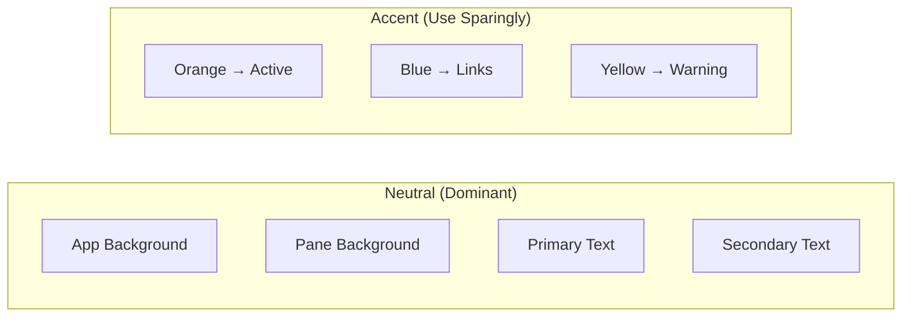
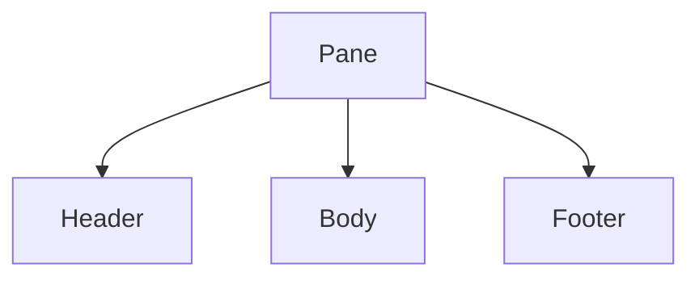

# BridgeMind UI Design Reference

> **Purpose**
>
> Dokumen ini berisi guideline visual yang diturunkan dari screenshot antarmuka **BridgeMind** (multi-pane agent dashboard).
>
> Gunakan dokumen ini sebagai **single source of truth** untuk menjaga konsistensi desain ketika membuat komponen maupun halaman baru.

---

# 0. Overall Layout

## Wireframe (ASCII)

```
┌──────────────┬───────────────────────────┬───────────────────────────┐
│ WORKSPACES 4 │ ○ Review project and…  ×  │▓ Launch …          5% ▓ ×▓│
│              │ ─────────────────────────  │▓ ───────────────────────▓│
│ Swarm 2      │ Two things worth flagging: │▓ The BOM overlay is up   ▓│
│ BridgeMind 8 │ 1. bridgemind_admin no...  │▓ and running. Here's...  ▓│
│▐BridgeMind 7▌│ 2. bridgeagent_memory...   │▓ • Server: bomb-sprint...▓│
│ GPT 5.5   6  │                            │▓ • Control panel: open...▓│
│              │ What would you like to...  │▓ Cooked for 12m 1s       ▓│
│              │ ─────────────────────────  │▓ ───────────────────────▓│
│              │ » auto mode on · agents    │▓» auto mode on · agents ▓│
├──────────────┼───────────────────────────┼───────────────────────────┤
│              │ ○ Review project and…  ×  │ ○ Review project and…  × │
│              │ ─────────────────────────  │ ───────────────────────  │
│              │ COUPON_PRICE_REFLECTION... │ PNG, matching the...      │
│              │ (main, 2 dirty)            │ ...                       │
│              │ ─────────────────────────  │ ───────────────────────  │
│              │ » auto mode on · agents    │» auto mode on · agents   │
└──────────────┴───────────────────────────┴───────────────────────────┘
```

### Legend

| Symbol | Meaning |
|---------|---------|
| `▐ ... ▌` | Sidebar item yang sedang dipilih |
| `▓` | Pane aktif / sedang berjalan (border oranye tebal) |
| `─` | Border standar antar pane (1px hairline) |

---

# 1. Design Philosophy

## Core Concept

BridgeMind bukan dashboard SaaS biasa.

Desainnya harus terasa seperti:

- terminal-native
- dense
- information-heavy
- developer workspace
- multi-agent monitoring dashboard

Bayangkan pengguna sedang mengawasi banyak AI agent yang berjalan secara paralel.

Bukan aplikasi yang fokus pada visual kosong atau whitespace besar.

---

# 2. Color Palette

## Color Tokens

| Token | Hex | Usage |
|--------|-----|-------|
| `--bg-app` | `#0E0E10` | Background aplikasi & sidebar |
| `--bg-pane` | `#161618` | Background isi pane |
| `--bg-pane-header` | `#1C1C1F` | Header pane |
| `--border-default` | `#2A2A2E` | Border standar |
| `--border-active` | `#E0813C` | Pane aktif / live |
| `--text-primary` | `#E8E8EA` | Teks utama |
| `--text-secondary` | `#8A8A90` | Metadata |
| `--text-link` | `#6EA8FE` | Path, filename, reference |
| `--text-warning` | `#E0C34C` | Warning |
| `--accent-sidebar` | `#5B8DEF` | Sidebar active item |
| `--bm-select` | `#3ECF8E` | Sidebar selection (row aktif, badge, accent bar) |
| *workspace tones* | violet / blue / teal / cyan / purple / indigo | Tile identitas workspace (di-hash dari id) |

---

## Color Rules

### Neutral Colors (≈95%)

- Background
- Borders
- Body text
- Metadata

Semua menggunakan grayscale.

---

### Accent Colors (≈5%)

Gunakan warna hanya untuk status.

| Color | Meaning |
|---------|---------|
| 🟧 Orange | Active / Live |
| 🟦 Blue | Link / Path / File |
| 🟨 Yellow | Warning |

> Jangan menambahkan aksen warna lain **untuk status**.

### Pengecualian: Selection & Identity (sidebar)

Dua hal berikut bukan status, jadi tidak boleh memakai oranye/kuning/merah —
kalau dipakai, "workspace yang sedang dilihat" jadi tidak bisa dibedakan dari
"workspace yang sedang jalan".

| Color | Meaning |
|---------|---------|
| 🟩 Green `#3ECF8E` | Selection — baris sidebar yang sedang dibuka |
| 🟪🟦 Workspace tone | Identitas workspace (tile 18px, warna di-hash dari id) |

Aturan prioritas pada baris sidebar: **live (oranye) > selected (hijau) >
netral**. Accent bar dan badge mengikuti urutan ini.

---



---

# 3. Typography

## Font

Gunakan font monospace untuk seluruh area data.

Rekomendasi:

- JetBrains Mono
- SF Mono
- Menlo
- IBM Plex Mono

---

## Size

| Element | Size |
|----------|------|
| Body | 12–13px |
| Header | 12–13px Medium |
| Metadata | 11px |

---

## Rules

✔ Hierarki dibuat menggunakan:

- posisi
- warna
- spacing

Bukan menggunakan ukuran font besar.

---

# 4. Layout & Grid

## Overall Structure

```
+ Sidebar (fixed)
+
+ Multi Pane Grid
    + Pane
    + Pane
    + Pane
    + Pane
```

---

## Characteristics

- Sidebar tetap
- Grid 2 kolom
- Gap antar pane hanya ±1px
- Tidak ada shadow
- Radius sangat kecil (2–4px)

Density adalah prioritas.

---

# 5. Pane Anatomy

Setiap pane wajib memiliki struktur berikut.

```
Pane
│
├── Header
│
├── Body
│
└── Footer
```

---

## Header

Berisi:

- title
- progress
- pin
- split
- expand
- close

Icon hanya muncul saat:

- hover
- active

---

## Body

Isi utama.

Boleh terdiri dari:

- bullet list
- log
- markdown
- code
- path
- warning

Contoh:

```
Server:
bridge-space

Control Panel:
localhost:3000

Warning:
Two things worth flagging...
```

---

## Footer

Selalu ada.

Contoh:

```
Cooked for 51s

auto mode on
for agents
```

---



---

# 6. Active vs Idle

## Active Pane

- Border oranye
- Border ±2px
- Progress badge
- Menjadi fokus utama layar

---

## Idle Pane

- Border abu
- Tanpa dekorasi tambahan

---

> Hanya boleh ada **SATU** pane aktif pada satu waktu.

---

# 7. Sidebar

## Header

```
WORKSPACES 4
```

- uppercase
- kecil
- redup
- letter spacing agak lebar

---

## Item

```
BridgeMind      7
GPT 5.5         6
Swarm           2
```

Berisi:

- nama
- badge angka

---

## Active Item

Menggunakan:

- background highlight tipis
- teks lebih terang

Tidak memakai border oranye.

---

# 8. Design Principles

## Density First

❌ Jangan gunakan padding besar.

✔ Informasi harus padat.

---

## Color Means Status

Gunakan warna hanya untuk:

- Orange → Active
- Blue → Reference
- Yellow → Warning

Tidak untuk dekorasi.

---

## Monospace Everywhere

Jika kontennya berupa:

- log
- path
- terminal
- filename
- markdown
- output AI

Gunakan monospace.

---

## Border over Shadow

✔ Border tipis

✖ Shadow

✖ Floating card

---

## Independent Pane

Setiap pane harus selalu memiliki:

```
Header

↓

Body

↓

Footer
```

Tidak boleh ada pane tanpa status.

---

# Visual Summary

| Area | Style |
|-------|-------|
| Background | Dark |
| Density | High |
| Border | Hairline |
| Shadow | None |
| Radius | 2–4px |
| Typography | Monospace |
| Accent Colors | Orange / Blue / Yellow |
| Layout | Sidebar + Multi Pane Grid |
| Active State | Orange Border |
| Idle State | Gray Border |

---

> **Summary**
>
> BridgeMind mengutamakan **information density**, **terminal-native aesthetics**, dan **multi-agent monitoring**.
>
> Seluruh keputusan visual harus mendukung tujuan tersebut, bukan mengikuti gaya dashboard SaaS modern yang penuh whitespace dan dekorasi.